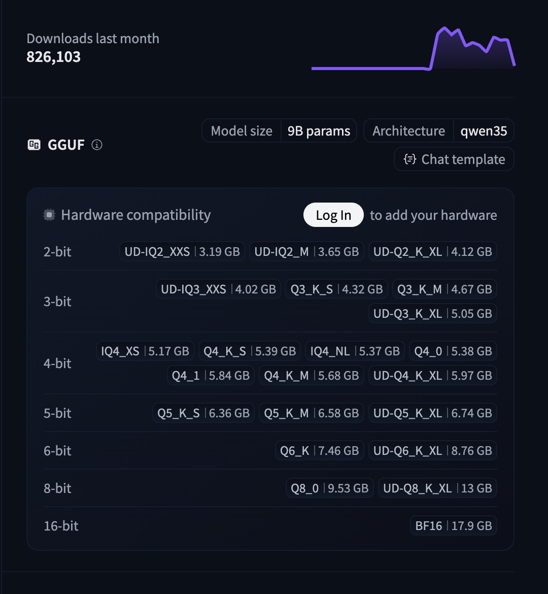

# Open Agent

This is an example on how to set up a coding agent using only free, open source tools, on your local machine.

Although it proved to be useful for the author, it is not meant to be a solution for every use case.

It is not meant to be better than your favourite, commercial agent. 

Instead, it provides a solution which is independent from commercial actors and licenses. 

As licenses for commercial software are often slow to be retrieved, this should allow experimenting freely without a particularly high cost.

Finally, using local agents provides useful details on how coding agents work under the hood. Potentially, this could lead to more cost-efficient prompts development.

## Disclaimer

Before starting experimenting with any of the tools presented in this document, it is your responsibility to do you own risk and security assessment. The author takes no responsibility.

As it is generally good practice to know what is happening under the hood. The author suggest to take a look at IBM's series on AI. Most importantly, [the following video.](https://youtu.be/gUNXZMcd2jU?si=W7X_wshcBfTfETTD)

## Tools

The solution provided is composed of multiple different layers of tools, organised as follows:

| Tool | Description | License |
|------|-------------|---------|
| VSCode | A highly customisable, free and open-source IDE | [MIT](https://github.com/microsoft/vscode/blob/main/LICENSE.txt) |
| continue.dev | A VSCode extension that allows to interact with AI coding agents and provides tools to them | [Apache 2.0](https://github.com/continue-dev/continue.dev/blob/main/LICENSE) |
| llama-swap | Allows to execute multiple models on the same machine, in parallel and on demand | [MIT](https://github.com/mostlygeek/llama-swap/blob/main/LICENSE.md) |
| llama.cpp | Provides access to LLMs through HTTP APIs | [MIT](https://github.com/ggml-org/llama.cpp/blob/master/LICENSE) |
| LLM Models | Models to provide answers to user prompts and implement agentic behavior | - |

### LLM Models

| Model | Description | License |
|-------|-------------|---------|
| Qwen3.5 9B | Latest model in the Qwen family by Alibaba Cloud. 9 billion parameters. Trained for reasoning, vision and tool usage. | [Apache 2.0](https://huggingface.co/Qwen/Qwen3.5-397B-A17B/blob/main/LICENSE) |
| Qwen2.5 Coder 3B Instruct | Older Qwen release with 1/3 parameters of Qwen3.5. Faster inference. Used for autocompletion. | [Non-commercial](https://huggingface.co/Qwen/Qwen2.5-Coder-3B-Instruct-GGUF/blob/main/LICENSE) |
| Nomic Embed Text V1.5 | Small model for text embeddings. Converts text into vectors for comparison. | Apache 2.0 |

## Prerequisites

The whole stack is being used proficiently with the following hardware specifications.

```md
Chip: Apple M3
Memory: 16GB
```

The experience may vary on different hardware. With fewer resources, largest models might not be fully offloaded to GPU for inference purposes. This might make inference itself slower.

## Get started

The following steps will guide you on how to set a proper AI assistant in VSCode. All these steps have alternatives. The ones proposed here showcase the solution which better suits the author's requirements, to the best of his knowledge at the time the document has been written. 

1. Install _VSCode_ in case you don't have it installed already. [See further instructions.](https://code.visualstudio.com/docs/setup/setup-overview)

2. Install _continue.dev_ from the extensions marketplace in VSCode. [See further instructions.](https://marketplace.visualstudio.com/items?itemName=Continue.continue)

3. Install _llama.cpp_. [See further instructions.](https://github.com/ggml-org/llama.cpp/tree/master?tab=readme-ov-file#quick-start)

    _llama.cpp_ can start a single server to provide access to a given LLM on its own. 
    
    Since we would need multiple servers running on demand, then we will use _llama-swap_ to execute multiple `_llama.cpp_` servers.

4. **Select models based on hardware compatibility**

    Before downloading models, it's important to choose the right quantization level based on your hardware specifications. Hugging Face provides information on model sizes according to quantization levels, typically displayed as a card on the right-hand side of the model page.
    
    
    
    **Guidelines for model selection:**
    
    - **For Apple M3 with 16GB RAM**: You can comfortably run models with up to 9B parameters at Q4_K_M quantization
    - **For smaller devices (8GB RAM or less)**: Consider using smaller models (3B parameters) or higher quantization levels (Q3_K_M, Q4_0)
    - **For maximum speed**: Use lower parameter counts or higher quantization (Q2_K, Q3_K_S)
    - **For best quality**: Use lower quantization levels (Q4_K_M, Q5_K_M, Q8_0) but be aware of memory requirements
    
    The three models used in this setup are:
    - **Qwen3.5 9B** (Agent model): Requires ~6-7GB RAM at Q4_K_M quantization
    - **Qwen2.5 Coder 3B Instruct** (Autocomplete model): Requires ~2-3GB RAM at Q4_K_M quantization
    - **Nomic Embed Text V1.5** (Embedding model): Requires ~1-2GB RAM at Q4_K_M quantization
    
    Always check the hardware compatibility information on the Hugging Face model page before downloading.

5. Download the LLM models. Here, we will use _llama.cpp_ to download models from huggingface to the local machine.

    _llama-swap_ does not allow to download models from hugging face on demand. Hence, this step must be done manually for each model.

    However, this is useful to assess whether the model is working or not. Some downloaded model are not suitable for _llama.cpp_ as they do not fulfill the LLaMa specifications.

    In order to download a the three models described in `Tools > Models`, execute the following commands:

    ```bash
    # Download embedding model
    llama-cli -hf nomic-ai/nomic-embed-text-v1.5-GGUF:Q4_K_M
    # Download autocomplete model
    llama-cli -hf unsloth/Qwen2.5-Coder-3B-Instruct-GGUF:Q4_K_M
    # Download agent model
    llama-cli -hf bartowski/Qwen_Qwen3.5-9B-GGUF:Q4_K_M
    ```

    The `-hf` argument allows to specify a model on HuggingFace. The `:Q4_K_M` postfix define quantisation. This has a direct impact on the size of the model. Please, refer to the rightmost part of the huggingface page of a specific model to check hardware compatibility.

    Using `llama.cpp` installed through **homebrew**, the download folder is set to `~/Library/Caches/llama.cpp`. This could vary. Another alternative would be to manually download the models to a user-defined folder.

6. Install _llama-swap_. [See further instructions.](https://github.com/mostlygeek/llama-swap?tab=readme-ov-file#homebrew-install-macoslinux)

7. Configure _llama_swap_ to serve the models downloaded in step 5. The configuration file in `llama-swap.yaml` allows to load all the three models on demand.

    Execute _llama-swap_ with the following command:
    ```bash
    llama-swap --config ./llama-swap.yaml --listen localhost:8080
    ```

    See further configuration options [here.](https://github.com/mostlygeek/llama-swap/blob/main/docs/configuration.md)

8. Configure _continue.dev_ extension for VScode to use various models provided by the _llama-swap_ server, for different roles.

A sample configuration is provided in `.continue/config.yaml`. To use this as global, default configuration, copy it in `/Users/$USER/.continue/config.yaml`, assuming a unix system is used.

**NOTE** Qwen3.5 model has got `provider: openai`, while the others have `provider: llama.cpp`. Although the second is the expected one in this configuration, it has provided unsuccessfull in tool calling. This is probably due to how the model was trained for this task. To overcome this, issue, the former setting has been preferred. Due to compatibility issues related to tool calling, the `.continue/rules/TOOLS.md` has been defined, as well.

It is also possible to instruct AI agent to always rely on rules defined per project. For example, clearly instructing an AI agent on always searching for a given file in `src/` would prevent him from scanning the whole root folder, making the whole searching process faster.

To do so, just create one or more markdown files in the `./continue/rules` folder detailing the desired ruleset. [See further information.](https://docs.continue.dev/guides/codebase-documentation-awareness).

## Known issues

### Context limitation

The `llama-swap.config` files defines the `--context` parameter to 48000 tokens. Good results have been obtained with smaller context of 12000 tokens as well.

In order to prevent filling up the context too quickly, it is to:

1. Instruct the model to be as concise as possible (Occam Razor).

2. Preferring targeted actions with limited scope, rather than broader, complex actions.

When an agent hits context limits, it throws an error. As generated tokens enter the context, then it there would be no place for newest ones. 

Rather than setting a larger context, it is possible to set the `--context-shift` argument in `llama-swap.config` configuration for Qwen3.5 model. 

As the model would then "forget" earlier tokens, it might tend allucinate. See further information [on model parameters.](https://github.com/ggml-org/llama.cpp/tree/master/tools/server)

### Tools mis-interpretation

Tool calls might be mis-interpreted by continue. Few times, the extension failed to represent diffs in the chat when **streaming** is enabled (default).

This seem to have been mitigated by introducing the `--jinja` argument in the `llama-swap.config` configuration.

Another a slight improvement was achieved by setting `.continue/rules/TOOLS.md`. Such a ruleset attempts to mitigate interference between tools calling, thinking and output streaming.

Another solution, would be to disable the stream function. However, this might have inpact on usability (user won't see the result of the agentic action until
done).

## Alternative Solutions

### Using Claude Code

Instead of the VSCode + continue.dev setup, you can use **Claude Code**, a commercial AI-powered coding assistant.

**Getting Started with Claude Code:**
1. Install the Claude Code CLI tool
2. Follow the [official documentation](https://docs.anthropic.com/en/docs/claude-code) for configuration
3. You can still use the same LLM models mentioned above if you want to run them locally and connect them to Claude Code.

**Note:** This document focuses on the open-source, self-hosted solution, but Claude Code can be a viable alternative depending on your needs and preferences.